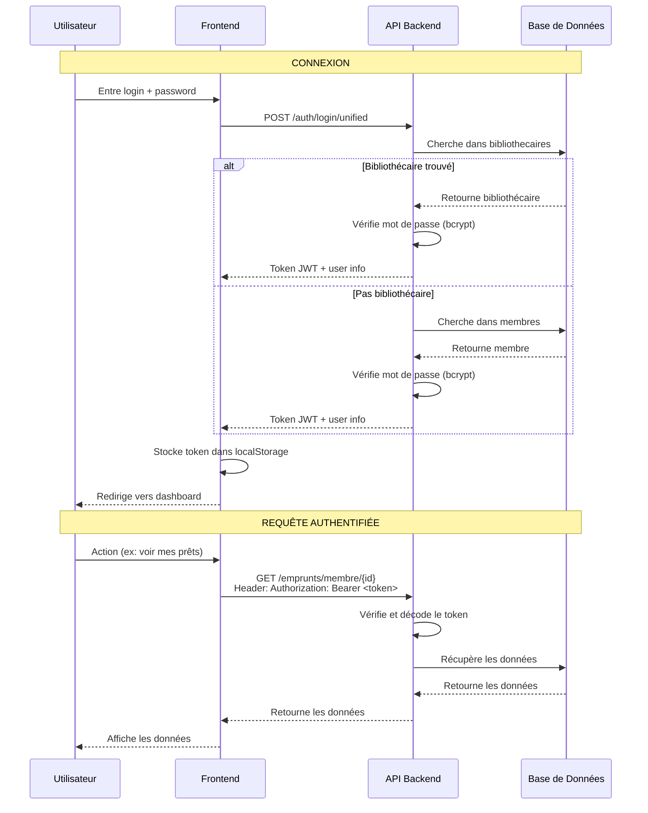

# 📚 Documentation - Flux d'Authentification et d'Inscription

## 🔐 Vue d'Ensemble

L'application utilise un système d'authentification basé sur **JWT (JSON Web Tokens)** avec trois types d'utilisateurs différents :

1. **Membres** (table `membres`)
2. **Bibliothécaires/Staff** (table `bibliothecaires`)
3. **Administrateurs** (sous-type de bibliothécaires)

---

## 🔄 Flux de Connexion (Login)

### 1. Frontend - Formulaire de Connexion

**Fichier :** `components/auth/login-page.tsx`

```typescript
const handleSubmit = async (e: React.FormEvent) => {
  e.preventDefault()
  setError("")
  setIsLoading(true)

  try {
    await login({ username: email, password })
  } catch (err: any) {
    setError(err.message || "Identifiants incorrects")
  } finally {
    setIsLoading(false)
  }
}
```

**Étapes :**
1. L'utilisateur entre son **login** (ou email ou numéro de carte) et son **mot de passe**
2. Le formulaire appelle la fonction `login()` du hook `useAuth`
3. Le hook gère la communication avec l'API

---

### 2. Hook d'Authentification

**Fichier :** `hooks/use-auth.tsx`

```typescript
const login = async ({ username, password }: LoginCredentials) => {
  setIsLoading(true)
  setError(null)

  try {
    // Appel à l'API unified login
    const data = await fetchApi("/auth/login/unified", {
      method: "POST",
      body: JSON.stringify({ username, password })
    })

    // Stockage du token et des infos utilisateur
    localStorage.setItem("token", data.access_token)
    localStorage.setItem("user", JSON.stringify(data.user))
    
    setUser(data.user)
    setRole(data.user.role)
    setIsAuthenticated(true)
  } catch (err: any) {
    setError(err.message)
    throw err
  } finally {
    setIsLoading(false)
  }
}
```

**Étapes :**
1. Envoie une requête POST à `/auth/login/unified`
2. Reçoit un token JWT et les informations utilisateur
3. Stocke le token dans `localStorage`
4. Met à jour l'état global de l'authentification

---

### 3. Backend - Endpoint Unified Login

**Endpoint :** `POST /auth/login/unified`

**Logique (côté backend) :**

```python
@router.post("/auth/login/unified")
async def unified_login(username: str, password: str):
    # 1. Essayer de se connecter en tant que BIBLIOTHÉCAIRE
    try:
        bibliothecaire = get_bibliothecaire_by_login(username)
        if verify_password(password, bibliothecaire.mot_de_passe):
            token = create_jwt_token(
                sub=bibliothecaire.login,
                role=bibliothecaire.role  # "Bibliothécaire" ou "Administrateur"
            )
            return {
                "access_token": token,
                "token_type": "bearer",
                "user": {
                    "id": bibliothecaire.id_bibliotecaire,
                    "login": bibliothecaire.login,
                    "email": bibliothecaire.email,
                    "nom": bibliothecaire.nom,
                    "prenom": bibliothecaire.prenom,
                    "role": bibliothecaire.role
                }
            }
    except NotFound:
        pass  # Pas un bibliothécaire
    
    # 2. Essayer de se connecter en tant que MEMBRE
    try:
        membre = get_membre_by_login_or_email_or_card(username)
        if verify_password(password, membre.mot_de_passe):
            token = create_jwt_token(
                sub=membre.login,
                role="Membre"
            )
            return {
                "access_token": token,
                "token_type": "bearer",
                "user": {
                    "id": membre.id_membre,
                    "login": membre.login,
                    "email": membre.email,
                    "nom": membre.nom,
                    "prenom": membre.prenom,
                    "numero_carte": membre.numero_carte,
                    "role": "Membre"
                }
            }
    except NotFound:
        pass  # Pas un membre
    
    # 3. Aucune correspondance trouvée
    raise HTTPException(status_code=401, detail="Identifiants incorrects")
```

**Étapes :**
1. Cherche d'abord dans la table `bibliothecaires`
2. Si non trouvé, cherche dans la table `membres`
3. Vérifie le mot de passe hashé avec bcrypt
4. Génère un token JWT avec le rôle approprié
5. Retourne le token et les infos utilisateur

---

## 📝 Flux d'Inscription

### Pour les Membres

**Il n'y a PAS de page d'inscription publique dans le frontend actuel.**

Les membres doivent être créés par un **bibliothécaire** ou un **administrateur** via :

#### Option 1 : Interface Staff
**Fichier :** `components/staff/staff-dashboard.tsx`

```typescript
const handleAddMember = async () => {
  const payload = {
    nom: nom.trim(),
    prenom: prenom.trim(),
    email: email.trim(),
    login: login.trim(),
    mot_de_passe: password.trim(),
    id_type_membre: parseInt(typeMembreId),
    telephone: telephone || null,
    adresse: adresse || null,
    date_naissance: dateNaissance || null
  }

  await fetchApi("/membres/", {
    method: "POST",
    body: JSON.stringify(payload)
  })
}
```

#### Option 2 : API Directe
**Endpoint :** `POST /membres/`

**Payload :**
```json
{
  "nom": "Dupont",
  "prenom": "Jean",
  "email": "jean.dupont@example.com",
  "login": "jdupont",
  "mot_de_passe": "password123",
  "id_type_membre": 1,
  "telephone": "+33612345678",
  "adresse": "123 Rue de la Paix",
  "date_naissance": "1990-01-01"
}
```

**Backend (automatique) :**
1. Hash le mot de passe avec bcrypt
2. Génère un numéro de carte unique
3. Crée le membre dans la base de données
4. Retourne le membre créé

---

### Pour les Bibliothécaires

**Seuls les administrateurs peuvent créer des bibliothécaires.**

#### Interface Admin
**Fichier :** `components/admin/bibliothecaire-panel.tsx`

```typescript
const handleSave = async () => {
  const payload: BibliothecaireCreate = {
    login: login.trim(),
    password: password.trim(),  // ⚠️ PROBLÈME ICI
    email: email.trim(),
    nom: nom.trim(),
    prenom: prenom.trim(),
    role: role
  }

  await fetchApi("/bibliothecaires/", {
    method: "POST",
    body: JSON.stringify(payload)
  })
}
```

**⚠️ PROBLÈME IDENTIFIÉ :**

Le frontend envoie `password` mais l'API attend `mot_de_passe` !

---

## 🐛 Bug dans la Création de Bibliothécaire

### Problème

**Frontend envoie :**
```json
{
  "login": "sly2",
  "password": "staff123",  // ❌ Mauvais nom de champ
  "email": "sly2@bibliotech.fr",
  "nom": "Staff",
  "prenom": "Test",
  "role": "Bibliothécaire"
}
```

**API attend :**
```json
{
  "login": "sly2",
  "mot_de_passe": "staff123",  // ✅ Bon nom de champ
  "email": "sly2@bibliotech.fr",
  "nom": "Staff",
  "prenom": "Test",
  "role": "Bibliothécaire"
}
```

### Solution

**Fichier à modifier :** `components/admin/bibliothecaire-panel.tsx`

**Ligne 130 :** Changer `password` en `mot_de_passe`

```typescript
// AVANT (ligne 128-135)
const payload: BibliothecaireCreate = {
    login: login.trim(),
    password: password.trim(),  // ❌
    email: email.trim(),
    nom: nom.trim(),
    prenom: prenom.trim(),
    role
}

// APRÈS
const payload = {
    login: login.trim(),
    mot_de_passe: password.trim(),  // ✅
    email: email.trim(),
    nom: nom.trim(),
    prenom: prenom.trim(),
    role
}
```

**Ligne 118 :** Même chose pour la mise à jour

```typescript
// AVANT (ligne 117-119)
if (password.trim()) {
    payload.password = password.trim()  // ❌
}

// APRÈS
if (password.trim()) {
    payload.mot_de_passe = password.trim()  // ✅
}
```

---

## 🔑 Gestion des Tokens JWT

### Structure du Token

```json
{
  "sub": "admin",           // Username (login)
  "role": "Administrateur", // Rôle de l'utilisateur
  "exp": 1768412906         // Expiration timestamp
}
```

### Utilisation dans les Requêtes

**Fichier :** `lib/api-client.ts`

```typescript
export async function fetchApi(endpoint: string, options: RequestInit = {}) {
  const token = typeof window !== 'undefined' 
    ? localStorage.getItem("token") 
    : null;

  const headers = {
    "Content-Type": "application/json",
    ...(token && { "Authorization": `Bearer ${token}` }),
    ...options.headers,
  };

  const response = await fetch(`${API_URL}${endpoint}`, {
    ...options,
    headers,
  });

  if (!response.ok) {
    const errorData = await response.json().catch(() => ({}));
    throw new Error(errorData.detail || "Une erreur est survenue");
  }

  return response.json();
}
```

**Étapes :**
1. Récupère le token depuis `localStorage`
2. Ajoute le header `Authorization: Bearer <token>`
3. Envoie la requête à l'API
4. Le backend vérifie le token et extrait le rôle

---

## 📊 Schéma Complet du Flux



---

## 🔒 Sécurité

### Hachage des Mots de Passe

**Backend utilise bcrypt :**

```python
from passlib.context import CryptContext

pwd_context = CryptContext(schemes=["bcrypt"], deprecated="auto")

# Lors de la création
hashed_password = pwd_context.hash(plain_password)

# Lors de la vérification
is_valid = pwd_context.verify(plain_password, hashed_password)
```

### Expiration des Tokens

- Les tokens JWT expirent après **24 heures** (configurable)
- Après expiration, l'utilisateur doit se reconnecter
- Le frontend redirige automatiquement vers la page de connexion

---

## ✅ Résumé

### Connexion
1. Frontend envoie `username` + `password` à `/auth/login/unified`
2. Backend cherche dans `bibliothecaires` puis `membres`
3. Backend vérifie le mot de passe hashé
4. Backend génère un token JWT avec le rôle
5. Frontend stocke le token et redirige

### Création de Membre
1. Staff/Admin remplit le formulaire
2. Frontend envoie à `POST /membres/`
3. Backend hash le mot de passe
4. Backend génère un numéro de carte
5. Backend crée le membre

### Création de Bibliothécaire
1. Admin remplit le formulaire
2. ⚠️ **BUG** : Frontend envoie `password` au lieu de `mot_de_passe`
3. Backend rejette la requête (champ manquant)
4. **SOLUTION** : Changer `password` en `mot_de_passe` dans le code

---

## 🔧 Correction à Appliquer

**Fichier :** `components/admin/bibliothecaire-panel.tsx`

**Changements :**
- Ligne 118 : `payload.password` → `payload.mot_de_passe`
- Ligne 130 : `password: password.trim()` → `mot_de_passe: password.trim()`

Après cette correction, le bouton "Ajouter" fonctionnera correctement !
